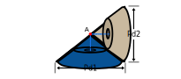
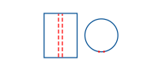

Bevel gears are among the most crucial types of gears available today. Their unique ability to transfer motion between non-parallel axes makes them versatile for a wide range of applications, especially in the automotive industry.

### Geometry

There are many different types of bevel gears, each designed for specific applications, which can also result in varying torque outputs, such as those seen in hypoid gears. However, the most defining characteristic of bevel gears is their geometry. Bevel gears are quite complex, so we will focus on a specific subset: 90-degree straight bevel gears. These are bevel gears with perpendicular axes and teeth that extend straight toward the center.

The teeth extend to the center to meet the requirement of transmitting rotation between non-parallel axes. While spur gears are made from cylinders, which transmit rotation between parallel axes, bevel gears utilize cone shapes. Now, cones can be viewed as a special variant of cylinders, they just happen to have an infinetly small top diameter. Same as with cylinders, to allow for rotation between the pair, their full body length must be in contact. However, this geometry ensures that when one cone rests on another, the axes change direction, accommodating the non-parallel requirement of bevel gears.

From the image, it is evident that the tips of the two cones meet at their respective apexes (indicated by the small red dot at the tips). If these cones are imagined to have no slipping in their rotations (meaning that if one cone rotates, the other rotates as well), they would behave similarly to spur gears. Now, what makes this geometry tricky, from the milling perspective, is that the tooth profile is constantly changing along the cone's length.

Previous sections emphasized the importance of milling in understanding gear geometry. However, when it comes to bevel gears, milling alone does not produce what can be considered a 'precision' gear. The reason is straightforward: the tooth profile constantly changes along the length of the cone, and since the height of one cone is half of its respective pair, there is no way for the two to mesh without the tooth profiles matching perfectly.

This is what makes bevel gear design so unique: **bevel gears are designed in pairs**. At first, this may seem strange. Why wouldn't it be possible to design two bevel gears independently and have them mesh together, as with almost all other sets of gears? To better understand this, let's look at a more graphical example:

First, let's picture the path that the tooth follows on spur gears. In the image above, the left side shows red lines representing the width of the teeth and their path along the material (cylinder). The right side of the figure provides the same view from above. It is important to note that the width of the tooth remains constant throughout the path. This is in contrast to bevel gears, where the tooth width varies as previously mentioned. Now, to visualize the effect on bevel gears, let's transform the cylinder into a cone by reducing the top diameter while keeping the bottom diameter the same:

As you might have guessed, the smaller the top diameter gets, the more the gap between the red lines closes. This illustrates the constant profile change along the cone's length. As we get closer to the tip of the cone, the width of the tooth becomes nonexistent (or zero, mathematically speaking). This change in width along the cone's length also affects all other dimensions of the tooth. 

Since the cone ends at a tip, it's safe to assume that the teeth no longer exist at that point. This is why most CAD software encounters errors when you try to extrude a profile along a conical shape. As the profile approaches the tip, it converges to a single point, transitioning from a 3-dimensional entity to a lesser-dimensional one.

This is why bevel gears do not exactly resemble cones that end in a tip. Instead, they are more like cones with the tip truncated. This design avoids the geometric issues that occur at the tip; if there's no tooth at the tip, it's unnecessary for the mesh.

Now that you understand why bevel gears are designed in pairs, we can delve deeper into their geometry.

### 90 degree bevel gears

Bevel gears with intersecting axes at 90 degrees are among the most common in the industry. However, they are a specific case of bevel gears where the axes are not at 90 degrees. You can skip this section if you are focusing on Non-90-Degree Bevel Gears, as the mathematics for 90-degree bevel gears also applies to configurations with different angles.

The basic geometry of a bevel gear is illustrated in figure {{fig:bevelGearDimensions.index}}. It is crucial to first understand bevel gears as cones since, **for 90 degree bevel gears,each pair of bevel gears is designed such that the height of one cone is the root radius of its mate**. These dimensions are critical when working with bevel gears, as ensuring both apexes meet is essential for proper meshing. Below, you will find the definitions for the symbols used in the images:

- $$C$$ is the length of both cone's diagonal and can be calculated using pitagoras theorem.
- $$F$$ is the face length of both bevel gears and its typically a third of the diagonal "C".
- $$A$$ is the apex of the bevel gear. Bevel gears must always meet at their apex in order to mesh.
- $$\phi$$ is half of the cone's angle, and is dependant on the root radii of the gears.
- $$r_f$$ is the root radius of the gear.
- $$r_{f2}$$ is the root radius of the mate.

The mathematical expressions for the above variables are:

{{eq:bevelGearConeDiagonalLength}}

{{eq:bevelGearDiagonalLength}}

{{eq:bevelPinionConeAngle}}

{{eq:bevelWheelConeAngle}}

Now, having understood the basic concepts for the dimensions of bevel gears, there is one more aspect to consider: tooth geometry. It was previously shown how transforming a cylinder into a cone affects the width of an arc section, and this is similar for bevel gear teeth. Bevel gear teeth are the same as spur gears in one plane only: at the beginning. As the teeth get closer to the apex, they become smaller and smaller until they converge into a single point. This is why bevel gears are not full cones.

