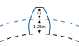
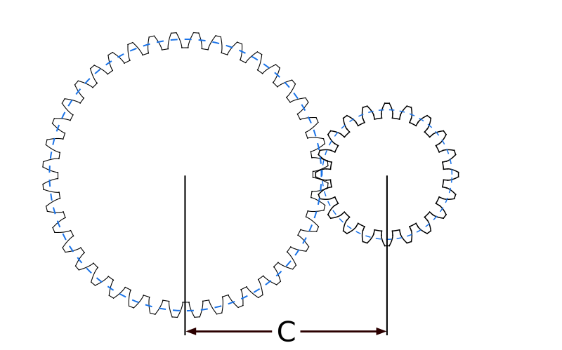

### Module

The **module** controls the size of the teeth, and thus, the size of the gear. Overall, the impact of the module on gear design can be summarized as follows:

`Larger module -> Larger teeth -> Larger gear`

In the image above, the **black** dashed line represents the root circumference of the gear (the one where the teeth start), and the **blue** dashed line the pitch circle.

- The pitch circle is where the teeth make contact when two gear's pitch circles are tangent.

### Pressure angle

The pressure angle affects the load capacity, the efficiency and the transmission error of a gear system. A higher pressure angle generally results in a stronger, more efficient and more accurate transmission, but also in higher friction and noise. In practice, a pressure angle of 20° to 25° is commonly used for gears.

- **Note**: The module and pressure angle for the teeth on the image above are the same for all of them, but the teeth themselves are not scaled for alignment purposes.

With an increase in pressure angle, the teeth become sharper. This, in turn, influences the minimum number of teeth required, as a higher pressure angle allows for fewer teeth in the gear.

### Gear dimensions

Two factors come into play when manufacturing and assembling gears together, the **addendum circle** and the **pitch circle**. The formulas for their respective diameters:

{{eq:pitchDiameter}}

{{eq:addendumDiameter}}

If you're planning to machine gears, the addendum circle represents the size of your material previous to the cutting. The pitch circle is just a reference for assembling gears together.

### Gear meshing

When assembling gears together, the distance between centers is derived from the position they take when their pitch circles are tangent. For external gears, the distance follows the expresion:

{{eq:externalGearDistanceBetweenCenters}}

And for internal gears:

{{eq:internalGearDistanceBetweenCenters}}

### Gear pairs

For gear pairs, the principles of the transmission between them can be expressed as follows:

- Smaller gear drives: `Torque increases -> Speed decreases`
- Larger gear drives: `Speed increases -> Torque decreases`

In other words *The torque ratio is inversely proportional of the speed ratio*.

Transmission of torque and speed between gear pairs is in function of the ratio between their number of teeth:

{{eq:transmissionRatio}}

TODO add better description for this...

Where:

- ω stands rotational speed.
- T stands for torque.
- z stands for the gear's number of teeth.