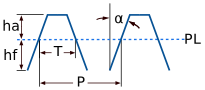
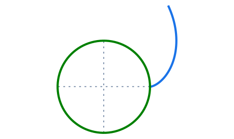
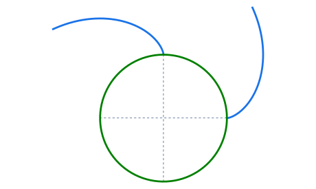
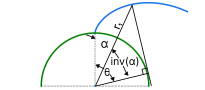
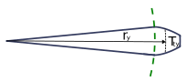
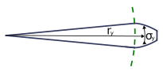

This section delves into the intricacies of gear geometry and aims to provide a comprehensive understanding of the various parameters and constraints that are required to produce accurate gears.

### Rack geometry

Understanding racks is more important than most people realize when designing gears as much of the geometry of other types of gears is directly influenced by it. For example:

- Hobbying: One of the most popular machining processes is essentially generating the involute profile by using a rack cutter in the shape of a screw (hard to visualize I know, but we'll get to it).

- External gear's tooth profile: Same as the Earth is round but we can only seem to see flat sections due to our limited scope/vision, you can visualize a rack as a section of an infinitely large gear.

This last example works as a preface to the following statement where *"as a gear gets larger, its teeth will resemble more and more a trapeze"*:

The geometry of a standart rack follows:

- Pitch line **PL**: The imaginary line where contact occurs between a rack and a gear.

- Pressure angle **α**: The pressure angle of the rack.

- Pitch **P**: The distance between teeth.
    - The equivalent to the external gear's pitch circle, yay!

- Tooth thickness **T**: The thickness of the tooth at the pitch line.
    - This will become relevant when talking about *profile shifting*.

- Addendum **ha**: The top portion of the tooth, it is the distance between the pitch line and the tip of the tooth.

- Deddendum **hf**: The bottom portion of the tooth, it's measured from the start of the tooth (the trapeze section, not the bottom of the rack) to the pitch line.

And their equations:

{{eq:rackPitch}}

{{eq:rackToothThickness}}

{{eq:addendum}}

{{eq:deddendum}}

Now that you understad rack geometry basics, you're ready to deep dive into gear design!

### Module

The module affects the size of the gear teeth, which is represented by the distance between the pitch radius and the tip of the tooth (addendum radius):

The image above shows the total height of the tooth, commonly known as **h** expressed in terms of the module:

{{eq:totalToothHeight}}

When selecting a module size, it's important to consider the effects it will have on the gear:  A larger module results in larger, stronger teeth, but since they also influence the pitch diameter they also produce a larger gear.

<TODO Table of DIN modules here>

### Pressure angle

The pressure angle affects the load capacity, the efficiency and the tooth profile (or how 'pointy' it is). It is defined as the angle between the line of action, which is the line connecting the points of contact between two meshing gears, and a line perpendicular to the plane of rotation of the gears.

- **Note**: The image above represents the effects of the pressure angle on tooth form for a gear with the same module and amount of teeth but they aren't scaled properly.

As depicted in the illustration, the **pressure angle affects the tooth form**. With an increase in pressure angle, the teeth become sharper. This, in turn, influences the minimum number of teeth required, as a higher pressure angle allows for fewer teeth in the gear.

A higher pressure angle generally results in a stronger, more efficient transmission, but also in a higher friction and noise. In practice, a pressure angle of 20° to 25° is commonly used for gears, although this may vary depending on the specific application and the materials used.

- **Note**: You can still find some gears with 14.5°, but they're not common.

### The involute curve

Modern gears use an involute profile to shape its teeth as it rolls smoothly when in contact with another, a condition called conjugated profiles.

An involute is *a specific type of mathematical curve that is traced by the end of a taut string as it is unwrapped from a stationary shape or curve*. In modern gear manufacturing, the involute of a circle is commonly used. 

In gear design, the involute portion of the teeh (yes, teeth are not all involute) starts at the base circle, and its cartesian equations are as follows:

{{eq:involuteXAxis}}

{{eq:involuteYAxis}}

- Where:
    - t is the angle (in radians) that determines the length of the involute curve (this is important for the roll angle section bellow).
    - σ is the angle where the involute starts expressed in radians (for the image, sigma is set to zero, hence why it starts at the positive X axis).

This expression allows to eassily rotate the involute, if you're insterested in plotting gears.

- **Note**: If the sigma value makes you uncomfortable, you can remove it and use a rotation matrix instead.

While the length of the involute curve is typically not a critical factor in most CAD software, it can be useful to control it. In such cases, parameter 't' in the equations [{{eq:involuteXAxis.number}}], [{{eq:involuteYAxis.number}}], can be used to set the length of the curve (say, to make it stop at the addendum radius).

The image above is a graphical representation of the roll angle **θ**. While it looks intimidating, its mathematical representation is rather simple:

{{eq:involuteRollAngle}}

Here, $$r_t$$ is the radius at which the involute curve coordinates are to be found. When $$t$$ equals $$\theta_{r_t}$$, the involute will be touching the circumference of the circle with radius $$r_t$$ at the resulting X,Y coordinates. With this in mind, an effective range for $$t$$ can be found for the following cases:

If $$r_b \geq r_r$$ then

$$
0 \leq t \leq \theta_{r_a}
$$

If $$r_b < r_r$$ then

$$
\theta_{r_r} \leq t \leq \theta_{r_a}
$$

- Where:
    - $$\theta_{r_t}$$ is the roll angle in terms of $$r_t$$
    - $$r_t$$ is the radius at which the roll angle is to be found.
    - $$r_b$$ is the base radius.
    - $$r_a$$ is the addendum radius.
    - $$r_r$$ is the root radius.

### Tooth geometry

While the geometry of teeth have been discussed in the involute and rack geometry sections, it is important to note that it varies between a rack and a real gear, especially in terms of tooth thickness.

- **Note**: $$T_{ty}$$ represents an arc length, *not an angle*.
    - Unlike angles, which are measured in degrees or radians, arc lengths represent the distance along a curved path.

The tooth thickness at an arbitrary radius, represented by the symbol , is illustrated in the image <TODO image no.>. Which can be calculated using the following expression:

{{eq:toothThickness}}

- **Note**: This equation only applies for radii equal or larger than the base radius and smaller or equal than the addendum radius ( $$r_b \leq r_y \leq r_a$$ ). 

Where:

- $$T_{ty}$$ is the tooth thickness.

- $$r_y$$ is the aribitrary radius at which the tooth thickness is to be found.

- $$z$$ is the number of teeth of the gear.

- $$\alpha$$ is the pressure angle of the gear.

- $$X$$ is the profile shifting coefficient.
    - If you don't know what it is, use 0 as its value.

- $$\alpha_{t}$$ is the transverse pressure angle (more about this on the helical gears section).
    - For spur gears $$\alpha_{t} = \alpha$$
    - Not to be confused with $$\alpha_{ty}$$.

{{eq:transversePressureAngle}}

- $$\beta$$ is the helix angle.
    - For spur gears $$\beta = 0$$

- $$\alpha_{ty}$$ is transverse pressure angle at an arbitrary radius $$r_y$$:

{{eq:transversePressureAngleAtRadius}}

- And the involute function definition stands as:

{{eq:involuteFunction}}

Although tooth thickness measured in arc length alone may not be very useful for gear design in CAD software, it can be used to calculate the corresponding tooth thickness angle.

Where $$\sigma_y$$ is the tooth thickness angle for the arbitrary radius $$r_y$$.

{{eq:angularToothThickness}}

- **Note**: The Helical gears and Profile shifting sections take a deeper dive into the helix and transverse angles, as well as the profile shifting coefficient.