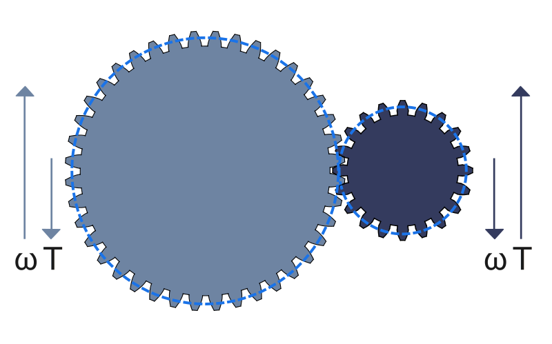
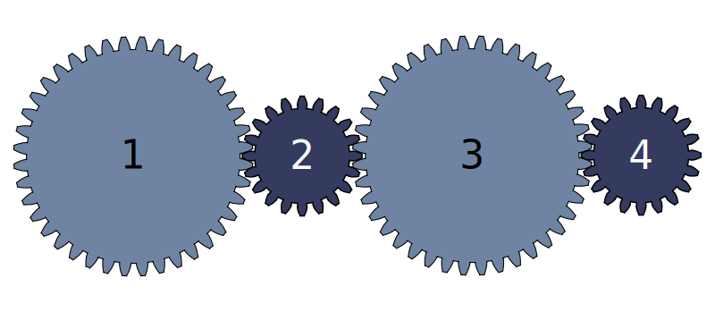
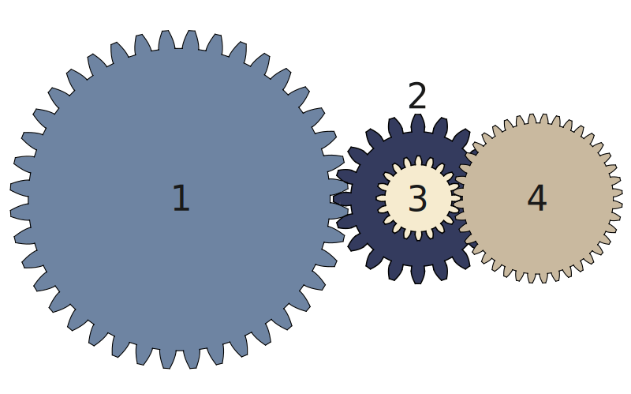
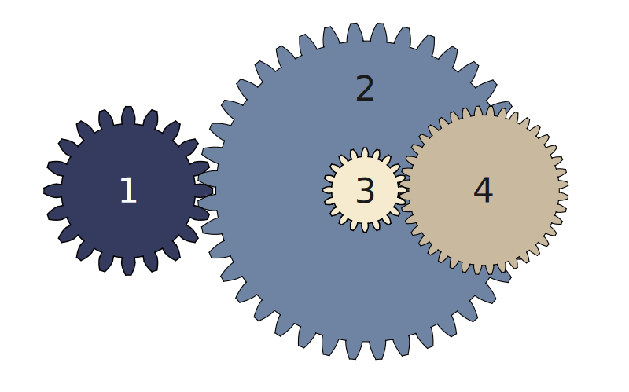

Gears are some of the best machinery components when it comes to the transmission of power, holding up to 98% efficiency! They also come in handy when constant speed must be transmitted between shafts, which is why they're so common.

Before you dive into this sections, there are some core concepts you need to be familiar with:

- *Torque*: Is a measure of the twisting or turning force applied on an object, such as a shaft or a wheel. It is typically measured in units of Newton-meters (N·m) or pound-feet (lb·ft) and is the rotational equivalent of linear force (or linear work).

- *Rotational speed*: Is a measure of how fast is an object is rotating. It is typically measured in units of rotations per minute (rpm).

- *Driving gear*: The gear that causes another gear to rotate in a mesh.

- *Driven gear*: The gear moves as a result of the driving gears' rotation.

- *Pinion*: A term used to describe the smaller gear of a pair.

- *Wheel*: A term used to describe the bigger gear of a pair.

- *Transmission ratio*: The relationship between the input and output of a mechanical system. Commonly represented with the $$i$$ parameter or a more explicit $$input:output$$, there are three types of transmission ratio:
    - *Direct*: Output is equal to the input.
        - $$i = 1$$
        - $$1:1$$
    - *Reduction*: Output is smaller than the input.
        - $$i > 1$$
        - $$2 : 1$$
    - *Overdrive*: Output is larger than input.
        - $$i < 1$$
        - $$1 : 2$$

- **Note**: When speaking of reduction and overdrive, it's the standard to refer exclusively about speed and not power as they're inversely proportional (as you're about to learn) which makes it redundant.
    - This is the nomenclature for the rest of this section.
    - Please know that when talking about transmission ratios they are simplified: There's no "100 to 50" transmission ratio but a "2 to 1" ratio instead.

### Speed and power transmission

Simplifying the visualization of gears as circles in contact comes very handy when understanding their power and speed transmission.

In a system of two tangent disks without slipping, as shown in image <TODO link to image 4>, the ratio of the diameters of both disks determines the relationship of their rotations. This relationship is called the transmission ratio, which can be expressed as:

$$
i = \frac{Driven}{Driving}
$$

For example, if the left disk drives the system (causing the other to move), the transmission ratio would be 2 ($$i = \frac{2m}{1m}$$). Conversely, if the right disk drives the system, the transmission ratio would be 0.5 ($$i = \frac{1m}{2m}$$).

For rotational speeds, the transmission ratio can be expressed as:

$$
i = \frac{\omega_{Driving}}{\omega_{Driven}}
$$

Where $$\omega$$ is the rotational speed.

- Commonly measured in rpm or radians/second.

The torque is inversely proportional to the rotational speed and can be expressed as:

$$
\frac{\omega_{Driving}}{\omega_{Driven}} = \frac{T_{Driven}}{T_{Driving}}
$$

Therefore

$$
i = \frac{T_{Driven}}{T_{Driving}}
$$

Where $$T$$ is the torque.
- Commonly in $$N \cdot m$$ or $$lb \cdot ft$$.

From these two equations, you can easily infer that the **speed is inversely proportional to the torque**. Meaning that if the speed goes up the torque must go down, which is what the following figure tries to display.

In the image above, if the gray gear is driving the speed increases while the torque decreases (left arrows). The opposite happens if the blue gear drives the system.

To assemble gears, it's important to make their pitch circles **tangent**. Now, since the pitch diameters $$d$$ are in function of the module and number of teeth of each gear, the transmission ratio can be determined using the teeth amount instead of the diameters, as the module cancels out:

$$
i = {d_{Driven}\over d_{Driving}} \rightarrow {(m \cdot z)_{Driven}\over (m \cdot z)_{Driving}} \rightarrow {\cancel{m}z_{Driven} \over \cancel{m}z_{Driven}}
$$

$$
\therefore i = {z_{Driven}\over z_{Driving}}
$$

Which means that **the gear system's transmission ratio is in function of their number of teeth**:

{{eq:transmissionRatio}}

Where $$\omega$$ is the rotational speed, $$T$$ is the torque, and $$z$$ is the number of teeth.

- **Remember**: For two gears to mesh, they need to share the same module and pressure angle.

Using Image <TODO refer to image 16> as an example, if the left gear has 40 teeth and the right gear has 20 teeth, the transmission ratio could be 2:1 or 1:2, depending on which gear is the driving gear. 

- **If the smaller gear drives**, **the torque will increase** but the speed will decrease by the ratio.

- **If the larger gear drives**, the speed will increase but **the torque will decrease** by the ratio.

### Simple gear trains

Gear trains are mechanisms where two or more gear arrangements are put to work. There are two types: simple and compund gear trains. Simple gear trains are those where all the gears are aligned alongside each other as represented in the following image:

The calculations for the transmission ratio in **simple gear trains** are very straightforward since **only the first and last gear matter**. For example, in image <TODO refer to image 17>, if gear #1 drives the system, what is the transmission ratio at gear #4 ? 
The gray gears have 40 teeth each, and the dark blue gears have 20 teeth each.

Using the general expression for the transmission ratio in a gear pair:

$$
i = \frac{z_{Driven}}{z_{Driving}}
$$

Substituting all the driven and driving gears:

$$
i = {z_{2} \cdot z_{3} \cdot z_{4}\over z_{1} \cdot z_{2} \cdot z_{3}} \rightarrow 
i = {\cancel{z_{2}} \cdot \cancel{z_{3}} \cdot z_{4}\over z_{1} \cdot \cancel{z_{2}} \cdot \cancel{z_{3}}} 
$$

$$
\rightarrow i = {z_{4}\over z_{1}} \rightarrow i = {20\over 40}
$$

$$
\therefore i = {1\over 2}
$$

This proves that the transmission ratio is only affected by the first and last gear, as the middle gears serve as both driving and driven gears, they will cancel each other out in the equation.

### Compound gear trains

Compound gear trains consist of gear pairs where the output gear drives the input gear of the next stage. Commonly, they are used to increase or decrease the speed or torque of a system.

Image <TODO reference image above> shows a compound gear train, where gears 1 and 4 have 40 teeth, and gears 2 and 3 have 20 teeth and are concentric. If gear 1 rotates at a speed of 10 rpm, what is the speed of gear 4?

The transmission ratio is determined by the number of teeth on each gear, as given by the following expression:

$$
i = \frac{z_{Driven}}{z_{Driving}}
$$

In the configuration shown, gear 1 drives gear 2, and gear 3 drives gear 4, giving:

$$
i = \frac{z_{2} \cdot z_{4}}{z_{1} \cdot z_{3}} \rightarrow i = \frac{20 \cdot 40}{40 \cdot 20}
$$

$$
\therefore i = {1}
$$

- **Note**: Unlike simple gear trains, in compound gear trains calculations the input of a stage connected to the output of another one doesn't serve as both driven and driving, even though it shares the same rotational speed.

This means that gear 4 is rotating at the same speed as gear 1, and the same is true for torque.

- **Remember**: Torque is inversely proportional to speed. If the speed triples, the torque decreases to a third, if the speed stays the same so does the torque.

Another example, in image <TODO reference img below>, the configuration for the gear train changes. If gear 1 is driving the system, what would be the transmission ratio at gear 4 ?

Using the general expression for the transmission ratio in a gear pair:

$$
i = \frac{z_{Driven}}{z_{Driving}}
$$

$$
i = \frac{z_{2} \cdot z_{4}}{z_{1} \cdot z_{3}} \rightarrow i = \frac{40 \cdot 40}{20 \cdot 20}
$$

$$
\rightarrow i = \frac{1600}{400}
$$

$$
\therefore i = 4
$$

This configuration is called a reducer because it reduces the speed but increases the torque. In our notation for reducers "A:B" the larger parameter will always be 'A'. This means for a reducer with a transmission ratio of 4, others may represent it as 0.25 or . Or the equivalent of having our notation of 4:1 switched to 1:4 (same as going from $$\frac{4}{1}$$ to $$\frac{1}{4}$$).

Other literatures may have it switched around, but don't worry, the math will be the same, only it'll be inversed.
