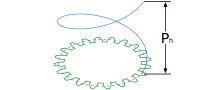
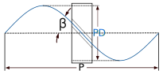
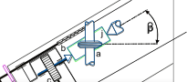
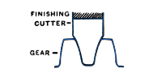
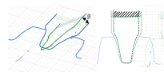
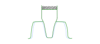
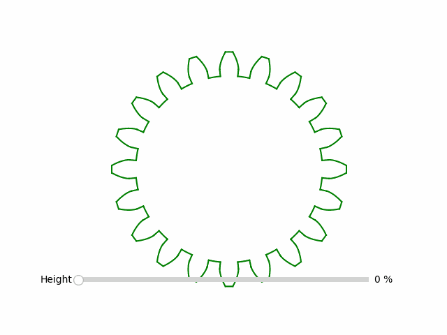
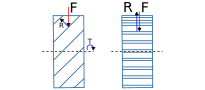
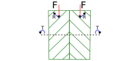

Helical gears are named for their teeth, which follow a helical path. This design has several advantages over other types of gears:

- Helical gears run **smoother and quieter**.
- They can **handle higher loads**.
- Since helical gears tend to have more teeth in contact at any given time, they experience less wear and last longer.
- They can transfer motion between non-paralel axes, a configuration known as **screw gearing**.

Despite their seemingly complex appearance, helical gears are essentially modified versions of spur gears, as we will demonstrate in this section.

- **Note**: It is my personal opion that spur gears should be viewed as a helical gear variant (helix angle equal to zero) and not the other way around.

### Helix curve

The key feature to understand in helical gears is the helx curve trajectory that their teeth follow. 

A helix is a three dimensional curve that resembles a spiral or a coiled spring. It is a curve that lies on a cylinder or cone, and it has a constant slope or pitch along its length. 

The parametric equations of the helix stand as follows:

$$
X = r \cdot \cos(t)
$$

$$
Y = r \cdot \sin(t)
$$

$$
Z = b \cdot t
$$

Where $$t$$ controls the circular span of the helix and $$b$$' is a parameter that controls the vertical advance of the helix alongside $$t$$ in the Z axis (the "pitch"):

$$
0 \leq t \leq 2\pi
$$

From figure {{fig:gearWithHelix.index}} you can visualize that the pitch "$$P_h$$" is the distance between the start and the end of the curve at one revolution:

$$
P_h = \pi \cdot D \cdot  {\cos(\beta)\over \sin(\beta)}
$$

Where 
- $$\beta$$ stands for the helix angle. 
    - The helix angle controls the steepness of the helix and redirects a portion of the applied force to the axis, giving helical gears the ability to handle more load. 
    - Because of this axial force, special bearings are required to handle it.

- $$D$$ is the diameter of the helix.
    - If you where to view the helix from above you would see a perfect circle (granted it at least completes a revolution).

In figure {{fig:helixAngle.index}}, the teeth of the gear are represented by two gray lines, and their inclination is determined by the helix angle. The steeper the helix angle, the greater the inclination of the teeth, which for a gear holding its pitch diameter results as a reduction in the pitch. Taking all of this, the helix parametric equations of a gear can be defined as:

{{eq:gearHelixXAxis}}

{{eq:gearHelixYAxis}}

{{eq:gearHelixZAxis}}

{{eq:gearHelixPitch}}

Where

$$
0 \leq t \leq 2\pi
$$

In this new set of equations, $$b$$ was replaced for a new expression. This new definition for $$b$$ makes it so that the total height of the helix caps at the pitch when it completes a full revolution. It may seem strange, but this is made to ensure that at one revolution, meaning when $$t$$ is equal to $$2\pi$$, the vertical distance between the start and ending points of the helix is equal to the pitch.

### Manufacturing systems

Unlike spur gears, machining for helical gears is not performed in the normal plane, but in an angled one relative to it: 

Figure {{fig:helicalMilling.index}} depicts the setup for helical gear manufacturing by milling with a disk cutter. The angle of inclination of the cutter relative to the central axis of the gear is defined by the helix angle $$\beta$$. This angle affects the size of the teeth, which differs from that of spur gears. The greater the helix angle, the more protruded the teeth become, resulting in a difference in tooth size between helical and spur gears.

Depending on the plane from where it is viewed, the size of the teeth for helical gears will differ from that of spur gears. This is represented in the image below, where there are two modules for reference: the normal module and the transverse module. 

The normal module $$m_n$$ is determined directly by the cutter, and when viewed from the plane normal to the cut, the teeth geometry is a direct and unmodified result from the cutting tool (since the space between the teeth left by the cutter will be the same as in spur gears). 

However, when the gear is viewed from the top/bottom, the teeth geometry is different (this is easier to visualize in gears with high helix angles) as they seem to be bigger in size.

This stems from the fact that the steeper the helix angle, the smaller the projection of the cutter will be on the plane perpendicular to the gear's axis. This leads to a smaller space between teeth, which increases their width. This can make the teeth appear to have a different module, called the **transverse module**, although they were made using the same cutter as their spur gear counterparts. The transverse module $$m_t$$ results from the projection of the normal module onto the face plane.

It is this difference in teeth that affetcs the geometry of helical gears, as the manufacturing methods available will require to address this in different ways. Overall, there are two systems for helical gear design: the **normal system** and the **radial system**.

The radial system is the simplest one to understand from a 3D modeling perspective: you tacke the 2D gear and extrude it along the vertical axis whilst twisting it, creating the helical trajectory for the teeth. This however comes with a caveat: by preserving the profile of the teeth alongside the helix path, the space between the teeth (aka. the one left by the actual cutter) is modified from which it is concluded that the radial system would need a special cutter per configuration (helix angle + module). Which is precissely what the normal method aims to solve: reutilization of cutting tools. In summary:

- Normal system
    - Allows utilizing the same cutter for different helix angles.
    - Dimensions for the gear will differ from its spur gear counterpart.
        - Thus the tooth profile will be different when viewed from the transverse plane.

- Radial system
    - Easier to 3D model.
        - And thus, suitable for alternative manufacturing methods like 3D printing.
    - Not reasonable to expect manufactured gears to hold this geometry.

#### Normal system

Helical gears of this system can be fabricated using conventional manufacturing methods, which makes them the default choice when hobbing or making gears with a mill. However, their core dimensions are different from that of their spur gear counterparts.

This stems from the fact that the more pronounced the helix angle, the smaller the space between the teeth. This can be better visualized with a machining example:

Figure {{fig:gearMilling.index}} shows a gear cutter used for milling, similar to figure{{fig:helicalMilling.index}}. Milling is probably the simplest gear making process to understand since the cutter shapes the space between teeth:

What's interesting is what would happen if the cutter was rotated as in figure {{fig:helicalMilling.index}}? How would the gear's teeth look? It is logical that by rotating the cutter, helical gears can be manufactured using milling. To understand the impact on the tooth geomtery, the image below introduces a cutter profile projection (color green) after it's rotated:

- **Note**: On the right side of the image, the green "cutter" lines are dashed because it is a projection, not the actual geometry of the cutter itself. You can think of it as its shadow. 

Figure {{fig:gearCutterRotated.index}} depicts the projection of the inclined cutter on the transverse plane. As you can see, when viewed from the top (or if you want to get technical, the transverse plane) the projection of the gear cutter is reduced. The more pronounced the helix angle is, the smaller the projection of the cutter will be. 

This is a key concept to understand why the basic dimensions of helical gears are different; the cutter is still the same, but by inclining it there's ought to be a modification on the resulting geometry.

- **Note**: The true involute resides at the normal plane in the normal system.
    - The involute on the transverse plan is a projection.

As shown in the picture above, a reduced projection of the cutter increases the width of the teeth. This is a big difference in teeth geometry when compared to spur gears: the greater the helix angle, the more notorious this difference will be. To compensate this, modifications to the material size used for milling are performed, meaning the dimensions for helical gears are different:

{{eq:transverseModule}}

{{eq:transversePressureAngle}}

{{eq:transversePitchDiameter}}

{{eq:transverseBaseDiameter}}

{{eq:transverseAddendumDiameter}}

{{eq:transverseRootDiameter}}

- **Note**: $$m_n$$ is the same as the previously referred to $$m$$.

An important thing to mention is that even though the geometry of the teeth changes, the addendum and deddendum stay the same. It may be hard to grasp why, but think about it: the gear cutter is still the same. As long as the cutter stays the same the addendum and deddendum won't change.

#### Radial system

Helical gears designed with the radial system have the same basic dimensions as their spur gear counterparts, making them an easy replacement for spur gears in an already defined system. This means that the **transverse module is equal to the normal module**.

Radial system helical gears are better suited for non-traditional manufacturing processes as it requires special machining tools to fabricate helical gears; with one cutting tool required per helix angle. This makes these kinds of gears not suitable for most machining processes (except for 3D printing, or 5-axis CNC milling) as the use of custom tooling is unattractive at best.

- **Note**: Whilst the helix in the image is in the addendum circle, the helix for the calculations (rotation, helix pitch) is defined at the pitch circle. 

Helical gears belonging to this system may be viewed as spur gears twisted along their vertical axis as shown in figure {{fig:helicalGearHelixPath.index}}. It may seem hard to grasp the transition of a 2D image into a 3D property, so I made a gif to illustrate this:

The animation above illustrates the section view of a helical gear when viewed from above as you move up its height. You can achive the same by using a 3D slicer (like Cura) and use the preview to see the layers alongside the vertical axis. This is important because for radial helical gears, **the real involute is in the transverse plane**.

### Double helical gears

Although helical gears pose sevaral advantages over spur gears, they do have inconveniences that must be taken into account when designing a mechanical system that utilizes them. The most relevant issue that arises is the **axial load** generated.

The axial load refers to the opposing force exerted on the gear's axis when a force is applied to the gear teeth. This stress on the axis can be problematic as it necessitates the use of special bearings, commonly known as 'thrust bearings,' to handle this specific type of load. These specialized bearings tend to be more expensive compared to the standard bearings used in various mechanical systems.

However, there exists a simple solution to mitigate this axial load, namely the implementation of double helical gears:

By mirroring the helical tooth, herringbone gears introduce an additional opposite axial force, effectively canceling out each other. This is depicted in the below diagram, where the two resulting axial forces 'R' are equal in magnitude but in opposite directions, same with the torques, where they cancel out each other:

This means that double helical gears don't face the same requirement for special bearings as helical gears do. Although this makes it look like the double helical gears are superior in every way to helical gears, they are more difficult and expensive to manufacture, making them less suitable for most applications.

### Screw gears

Screw gears, also known as crossed helical gears, are a type of gearing mechanism where two helical gears are positioned such that their axes are not parallel to each other. Unlike traditional parallel-axis helical gears, screw gears can be used in applications that require non-parallel axes. 

### Positioning

Positioning helical gears is as simple as with their spur gear counterpart, there are just some extra things to consider when doing so:

- Helical gears follow the same basic rules of spur gear meashing: they must share the same module and pressure angle so they can mesh with each other.

- Helical gears with parallel axes must have the same helix angle to ensure smooth meshing..

- To find the distance between centers can be determined by making their pitch circles tangent to each other, regardless of whether they are crossed helical gears or not.

- For helical gears to mesh, they must be of the same helical system.

- When designing crossed helical gears with a 90-degree angle between their axes the sum of their helix angles should be 90 degrees to ensure proper meshing.
