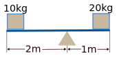
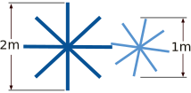
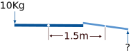
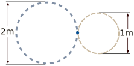
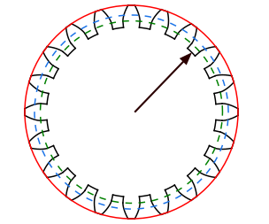
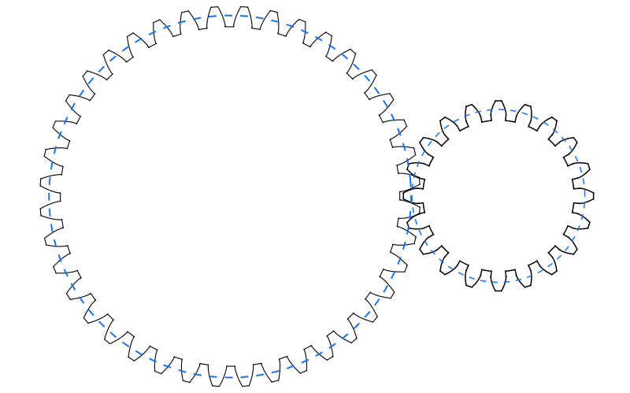

## What are gears ?

Gears are mechanical devices that transmit power and motion between two or more rotating shafts. They are one of the most important inventions in mechanical system history and have been used for over centuries for a wide range of applications.

### How do gears actually work ?

Gears work under the principle of levers, where a small force applied at one point is amplified and transferred to another point. 

In the image above, the system is balanced due to the levers principle, as the 10kg multiplied by its lever length (2m) is equal to the right weight (20kg) multiplied by its arm length (1m). This means that '(10kg * 2m) = (20kg * 1m)'.

Therefore, gears can be visualized as a set of levers organized in a circular configuration: 

The calculations for this lever array do not change, they still use the same levers principle. As an example, if 10kg of force is applied to the left array, what would be the necessary force applied to the right array to balance it out? For the sake of simplicity, consider both arrays are touching at a single tangent point, and that their center distance is the sum of half of both lever lengths (ignoring that continuous contact would be impossible for this geometry): 

With the image above, the similarities with the system on image (1) are obvious, only this time there is no fulcrum at the center since each lever has its own rotational point (white dots) at their own center. This means that the resulting force for the right lever can be calculated as '(1m * 10kg) - (0.5m * x) = 0'. We isolate 'x' getting 'x = (1m * 10kg)/(0.5m)' meaning that 'x' is equal to 20kg.

- **Note**: 1m and 0.5m are used since both arms are rotating around their respective fulcrums (white dots), so their actual lever length corresponds to half their total arm length.

Furthermore, these lever arrays can be visualized as simply two tangent disks:

The distance between the centers of the two disks is equal to the sum of their radii (1.5m). If there is no slipping between the disks during rotation, it can be deduced that for every one full rotation of the left disk, the right disk completes two full rotations in the opposite direction. This is due to the diameters ratio, which is determined by diving the diameter of the left disk (2m) by the diameter of the right disk (1m) equaling 2. 

The same would be true for the inverse, for every full rotation of the right disk, the left one would make half a rotation.

**Gears can be easily understood when visualized as circles in contact at a single point, as will be demonstrated in the following sections**.

### Gear dimensions

The fundamentals of gear geometry are relatively straightforward, particularly when visualized as two circles in contact. When designing gears, there are four circles to consider, but mostly only one is crucial when assembling them.

Addendum Circle: The outer circumference of the gear, represented by a **solid red circle**.

Pitch Circle: The circumference where the gears make contact, represented by a **blue dashed circle**.

Base Circle: The circumference where the involute portion of the teeth starts, represented by a **green dashed circle**.

Root Circle: This is the circumference where the teeth begin, represented by black arc sections, as **indicated by the arrow**.

- **Note**: The base circle isn't always larger than the root circle. 

The respective formulas for the diameters of each circumference are as follows:

{{eq:pitchDiameter}}

{{eq:baseDiameter}}

{{eq:addendumDiameter}}

{{eq:rootDiameter}}

Where **m** represents the module, **z** stands for the number of teeth for the gear (also refered as 'N'), and **α** is the pressure angle. These concepts are further explained in the gear geometry theory section.

### Gear meshing rules and positioning

There are various types of gears, but there are certain guidelines that can be followed for the majority of them during assembly:

- Mating gears must share the **same module**.
- They must also have the **same pressure angle**.
- They must be **tangent at their pitch circles**.
    - Note: This is not a requirement really, the involute profile of the teeth allows for some leeway.

By keeping these guidelines in mind, determining the distance between centers of two external gears becomes simple. In the image above, the distance between centers for two external gears, in this case spur gears, is simply the sum of their pitch radii, which can be calculated using the following equation:

{{eq:externalGearDistanceBetweenCenters}}
